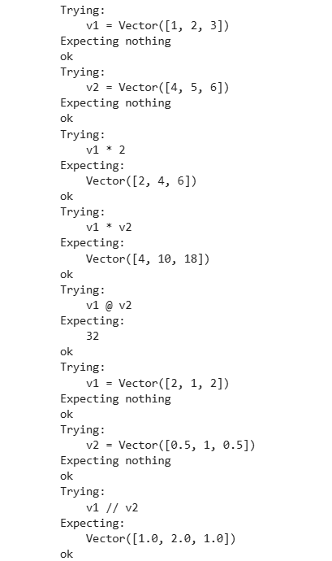
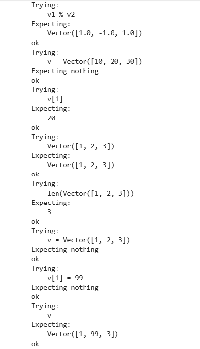
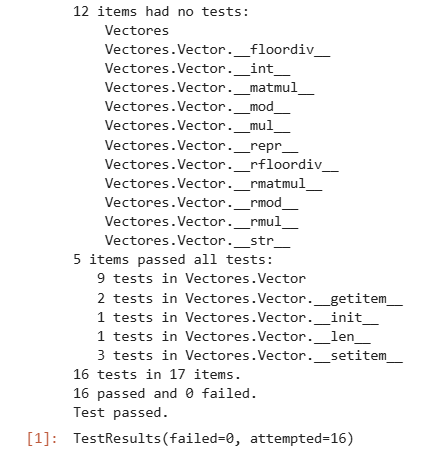

# Tercera tarea de APA: Multiplicación de vectores y ortogonalidad

## Nom i cognoms

> [!Important]
> Introduzca a continuación su nombre y apellidos:
>
> Bruno Mario Daidone Rossini

## Aviso Importante

> [!Caution]
>
> 
> El objetivo de esta tarea es programar en Python usando el pardigma de la programación
> orientada a objeto. Es el alumno quien debe realizar esta programación. Existen bibliotecas
> que, si lugar a dudas, lo harán mejor que él, pero su uso está prohibido.
>
> ¿Quiere saber más?, consulte con el profesorado.
  
## Fecha de entrega: 6 de abril a medianoche

## Clase Vector e implementación de la multiplicación de vectores

El fichero `algebra/vectores.py` incluye la definición de la clase `Vector` con los
métodos desarrollados en clase, que incluyen la construcción, representación y
adición de vectores, entre otros.

Añada a este fichero los métodos siguientes, junto con sus correspondientes
tests unitarios.

### Multiplicación de los elementos de dos vectores (Hadamard) o de un vector por un escalar

- Sobrecargue el operador asterisco (`*`, correspondiente a los métodos `__mul__()`,
  `__rmul__()`, etc.) para implementar el producto de Hadamard (vector formado por
  la multiplicación elemento a elemento de dos vectores) o la multiplicación de un
  vector por un escalar.

  - La prueba unitaria consistirá en comprobar que, dados `v1 = Vector([1, 2, 3])` y
    `v2 = Vector([4, 5, 6])`, la multiplicación de `v1` por `2` es `Vector([2, 4, 6])`,
    y el producto de Hadamard de `v1` por `v2` es `Vector([4, 10, 18])`.

- Sobrecargue el operador arroba (`@`, multiplicación matricial, correspondiente a los
  métodos `__matmul__()`, `__rmatmul__()`, etc.) para implementar el producto escalar
  de dos vectores.

  - La prueba unitaria consistirá en comprobar que el producto escalar de los dos
    vectores `v1` y `v2` del apartado anterior es igual a `32`.

### Obtención de las componentes normal y paralela de un vector respecto a otro

Dados dos vectores $v_1$ y $v_2$, es posible descomponer $v_1$ en dos componentes,
$v_1 = v_1^\parallel + v_1^\perp$ tales que $v_1^\parallel$ es tangencial (paralela) a
$v_2$, y $v_1^\perp$ es normal (perpendicular) a $v_2$.

> Se puede demostrar:
>
> - $v_1^\parallel = \frac{v_1\cdot v_2}{\left|v_2\right|^2} v_2$
> - $v_1^\perp = v_1 - v_1^\parallel$

- Sobrecargue el operador doble barra inclinada (`//`, métodos `__floordiv__()`,
  `__rfloordiv__()`, etc.) para que devuelva la componente tangencial $v_1^\parallel$.

- Sobrecargue el operador tanto por ciento (`%`, métodos `__mod__()`, `__rmod__()`, etc.)
  para que devuelva la componente normal $v_1^\perp$.

> Es discutible esta elección de las sobrecargas, dado que extraer la componente
> tangencial no es equivalente a ningún tipo de división. Sin embargo, está
> justificado en el hecho de que su representación matemática es dos barras
> paralelas ($\parallel$), similares a las usadas para la división entera (`//`).
>
> Por otro lado, y de manera *parecida* (aunque no idéntica) al caso de la división
> entera, las dos componentes cumplen: `v1 = v1 // v2 + v1 % v2`, lo cual justifica
> el empleo del tanto por ciento para la componente normal.

- En este caso, las pruebas unitarias consistirán en comprobar que, dados los vectores
  `v1 = Vector([2, 1, 2])` y `v2 = Vector([0.5, 1, 0.5])`, la componente de `v1` paralela
  a `v2` es `Vector([1.0, 2.0, 1.0])`, y la componente perpendicular es `Vector([1.0, -1.0, 1.0])`.

### Entrega

#### Fichero `algebra/vectores.py`

- El fichero debe incluir una cadena de documentación que incluirá el nombre del alumno
  y los tests unitarios de las funciones incluidas.

- Cada función deberá incluir su propia cadena de documentación que indicará el cometido
  de la función, los argumentos de la misma y la salida proporcionada.

- Se valorará lo pythónico de la solución; en concreto, su claridad y sencillez, y el
  uso de los estándares marcados por PEP-ocho.

#### Ejecución de los tests unitarios

Inserte a continuación una captura de pantalla que muestre el resultado de ejecutar el
fichero `algebra/vectores.py` con la opción *verbosa*, de manera que se muestre el
resultado de la ejecución de los tests unitarios.





#### Código desarrollado

Inserte a continuación el código de los métodos desarrollados en esta tarea, usando los
comandos necesarios para que se realice el realce sintáctico en Python del mismo (no
vale insertar una imagen o una captura de pantalla, debe hacerse en formato *markdown*).

```python
class Vector:
    """
    Bruno Mario Daidone Rossini

    >>> v1 = Vector([1, 2, 3])
    >>> v2 = Vector([4, 5, 6])

    Multiplicación por escalar:
    >>> v1 * 2
    Vector([2, 4, 6])

    Producto de Hadamard:
    >>> v1 * v2
    Vector([4, 10, 18])
    
    Producto escalar:    
    >>> v1 @ v2
    32
    
    Prueba de componentes paralela y perpendicular.

    >>> v1 = Vector([2, 1, 2])
    >>> v2 = Vector([0.5, 1, 0.5])

    Componente paralela:
    >>> v1 // v2
    Vector([1.0, 2.0, 1.0])

    Componente perpendicular:
    >>> v1 % v2
    Vector([1.0, -1.0, 1.0])

    """

    vector = []
    vector = list()

    def __int__(self, iterable):
        """
        Constructor alternativo (incorrecto) que intenta crear un vector
        a partir de un iterable. No se usa normalmente.
        """
        self.vector = [expreson for elemento in iterable]

    def __init__(self, iterable=None):

        """
        Constructor principal de la clase Vector.
        Recibe un iterable y almacena sus valores como lista interna.

        >>> Vector([1, 2, 3])
        Vector([1, 2, 3])
        """
        self.vector = [valor for valor in iterable]

    def __repr__(self):
        """
        Representación oficial del vector, útil para depuración.
        Devuelve una cadena del tipo: Vector([1, 2, 3])
        """
        return 'Vector(' + repr(self.vector) + ')'

    def __str__(self):
        """
        Representación informal del vector, pensada para impresión.
        """
        return str(self.vector)

    def __getitem__(self, key):
        """
        Permite acceder a un elemento del vector mediante índices.

        >>> v = Vector([10, 20, 30])
        >>> v[1]
        20
        """
        return self.vector[key]

    def __setitem__(self, key, value):
        """
        Permite modificar un elemento del vector mediante índices.

        >>> v = Vector([1, 2, 3])
        >>> v[1] = 99
        >>> v
        Vector([1, 99, 3])
        """
        self.vector[key] = value
    
    def __len__(self):
        """
        Devuelve la longitud del vector.

        >>> len(Vector([1, 2, 3]))
        3
        """
        return len(self.vector)

    def __mul__(self, other):
        """
        Sobrecarga del operador *.
        Si 'other' es un número, realiza multiplicación por escalar.
        Si 'other' es otro vector, realiza el producto de Hadamard.
        """

        if isinstance(other, (int, float, complex)):
            return Vector(uno * other for uno in self)
        else:
            return Vector(uno * otro for uno, otro in zip(self, other))


    def __rmul__(self, other):
        """
        Multiplicación por la izquierda.
        Permite expresiones como: 2 * Vector([1, 2, 3])
        """
        return self.__mul__(other)
        
    def __matmul__(self, other):
        """
        Producto escalar entre dos vectores usando el operador @.
        """
        return sum(a * b for a, b in zip(self.vector, other.vector))

    def __rmatmul__(self, other):
        """
        Producto escalar por la izquierda.
        Permite expresiones como: v @ w o w @ v indistintamente.
        """
        return self.__matmul__(other)

    def __floordiv__(self, other):
        """
        Proyección del vector actual sobre otro vector usando //.
        Calcula: (self·other / other·other) * other
        """
        escalar = (self @ other) / (other @ other)
        return Vector([escalar * x for x in other.vector])

    def __rfloordiv__(self, other): 
        """
        Proyección por la izquierda.
        Permite calcular la proyección cuando el vector aparece
        a la derecha del operador //, es decir: u // v.
        """
        return other.__floordiv__(self)

    def __mod__(self, other):
        """
        Devuelve la componente normal de este vector respecto a 'other'.
        Es decir: v % u = v - proyección_de_v_sobre_u.
        """
        proy = self // other
        return Vector(a - b for a, b in zip(self.vector, proy.vector))

    def __rmod__(self, other):
        """
        Permite calcular la componente normal cuando el vector aparece
        a la derecha del operador %, es decir: u % v.
        """
        return other.__mod__(self)

if __name__ == "__main__":
    import doctest
    doctest.testmod()
```


#### Subida del resultado al repositorio GitHub y *pull-request*

La entrega se formalizará mediante *pull request* al repositorio de la tarea.

El fichero `README.md` deberá respetar las reglas de los ficheros Markdown y
visualizarse correctamente en el repositorio, incluyendo la imagen con la ejecución de
los tests unitarios y el realce sintáctico del código fuente insertado.
